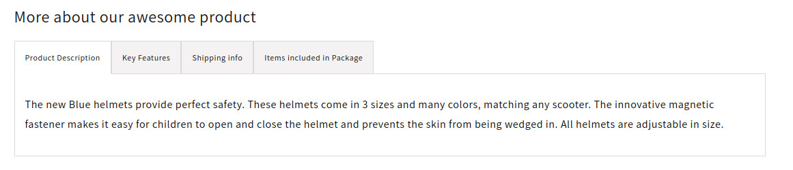

# Shopify Challenge

In this challenge you will create a new product template using Shopify Dawn as a starter. The new template will showcase product tabs with more information about the product. There are four different tabs that a product might or not have. An example can be seen [here](https://apps.shopify.com/smart-tabs), click on **View demo store**. Do not use jQuery or any other JS library.

Once you're done you will need to share access to your development store so we can test the Customizer and metafields integrations.

We have two flavors of this challenge depending on your skills:

- Regular Dawn
- Dawn + Tailwind (bonus points)

Choose your setup below.

## Setup

#### Regular Dawn

- Create a development store and fill it with test data, [follow this guide](https://shopify.dev/docs/apps/tools/development-stores#create-a-development-store-to-test-your-app).
- Create a repository in Github, clone it on your machine and `pull` Shopify's Dawn theme into your folder. Save and push your changes as your initial `commit` (this will help us track your changes over the theme).

#### Dawn + Tailwind (bonus points)

- Create a development store and fill it with test data, [follow this guide](https://shopify.dev/docs/apps/tools/development-stores#create-a-development-store-to-test-your-app).
- [Fork this repo in Github](https://github.com/odestry/dawn-with-tailwindcss/), start your local development server.

## The challenge

- Create a new `product` template (JSON), call it `with_tabs`.
- Create a new `section` called `main-product-tabs`, use Shopify Schema to define the following settings and blocks:
  - Section title
  - All the blocks should have a `title` setting to change the tab's title.
- Define four block types with settings:

#### Product description

The content of the tab should come from the product description itself. If the product description is empty this tab shouldn't render.

#### Key Features

Should contain bullets in a `richtext` coming from the `product metafields`, if the metafield isn't set the tab shouldn't render.

#### Shipping info

Settings: `content`, static content coming from the Customizer.

#### Items included in Package

This will be a dynamically rendered block, on page load it will show an "empty" text message and a button. The text should come from the Customizer, on click the button [should fetch this API](https://jsonplaceholder.typicode.com/) and render cards with the API data (id, title, completed and user id), the card styles changes when the data is completed or not. The `number` of cards to render should also come from the Customizer.

### Bonus points:

- Use `Tailwind` to style your section, see **Dawn + Tailwind (bonus points)** above.
- Use a metaobject to save the Shipping info content, then link that to the customizer.
- Use HTML `<template>` to render the cards at `Items included in Package`.

## Acceptance criteria:

- As a user I should be able to see at least `one` product page that looks exactly as any other Dawn product page (unchanged)
- As a user I should be able to see at least `one` product page with tabs.
  - I should be able to reorder the tabs on the Customizer
  - I should be able to rename each tab
  - I should be able to hide each corresponding tab if: Product description is empty, Key Features metafield isn't set or Shipping information isn't set on the customizer.
  - I should be able to click on the `Items included in Package` button and get as many cards as set on the Customizer, I should be able to increase or decrease the number of cards shown through the Customizer (minimum: 3, maximum 10).
