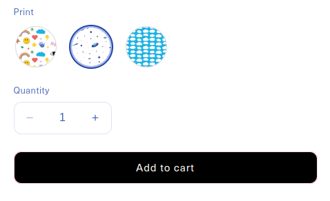
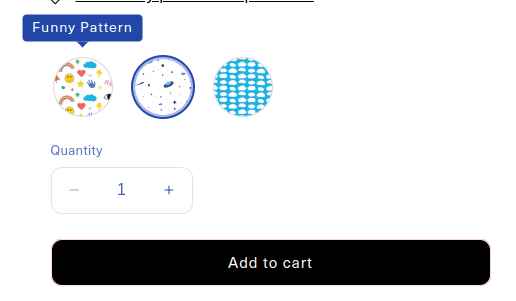
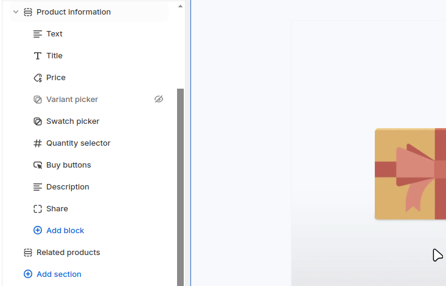

# Shopify Challenge

In this challenge you will create image swatches for the products using Shopify Dawn as a starter. The new theme will showcase product swatches that will let users choose more efficiently their options. 

Once you're done you will need to **share access to your development store** so we can test the Customizer and metafields integrations.

We have two flavors of this challenge depending on your skills:

- Regular Dawn
- Dawn + Tailwind (bonus points)

Choose your setup below.

## Setup

#### Regular Dawn

- Create a development store and fill it with test data, [follow this guide](https://shopify.dev/docs/apps/tools/development-stores#create-a-development-store-to-test-your-app).
- Create a repository in Github, clone it on your machine and `pull` Shopify's Dawn theme into your folder. Save and push your changes as your initial `commit` (this will help us track your changes over the theme).

#### Dawn + Tailwind (bonus points)

- Create a development store and fill it with test data, [follow this guide](https://shopify.dev/docs/apps/tools/development-stores#create-a-development-store-to-test-your-app).
- [Fork this repo in Github](https://github.com/odestry/dawn-with-tailwindcss/), start your local development server.

## The challenge

- Define a new block type on `sections/main-product` just below `variant_picker`, call it `swatch_picker` (keep the other blocks so the user can choose how to show their variants).
- The new block should have the following settings:
  - Title (`text`), used on top of the swatches list as a title, for example: 'Print'.
  - Fallback image (`image_picker`), used if the swatch image isn't set.
- Each `swatch` will come from product variant, it should have the same behavior as the other variant pickers: 
  - On click it should select the variant.  When selected should be highlighted.
  - If sold out should be disabled
  - On hover should show a **tooltip** with the variant's name
  - Add to cart **must work**
- The image for the swatch should come from:
  - A variant metafield or
  - A metaobject reference to make the images reusable **(Bonus points)**
  - Render images on the size needed, not bigger.

Hover behavior:

This is how the Customizer should look once you are done:

Patterns can be found here:  [https://www.toptal.com/designers/subtlepatterns/tag/tile/](https://www.toptal.com/designers/subtlepatterns/tag/tile/)

### Bonus points:

- Use `Tailwind` to style your block, see **Dawn + Tailwind (bonus points)** above.
- Use metaobjects to store and reference each swatch image and title, making it easier to modify.

## Acceptance criteria:

- As a user I should be able to set swatches on my product.
- As a user I should be able to switch back to the regular variant behavior (pills or dropdown).
- As a user I should be able to select on each of my product variants a swatch image, if the image isn't set the Fallback image (Customizer) should show.
- As a user I should be able to change the title on top of the swatches (Customizer).
- As a user if a variant is sold out the tooltip should show on hover but I shouldn't be able to select it and buy it.
- All cart functions should be working.
- Pay attention to details and overall look and feel.
